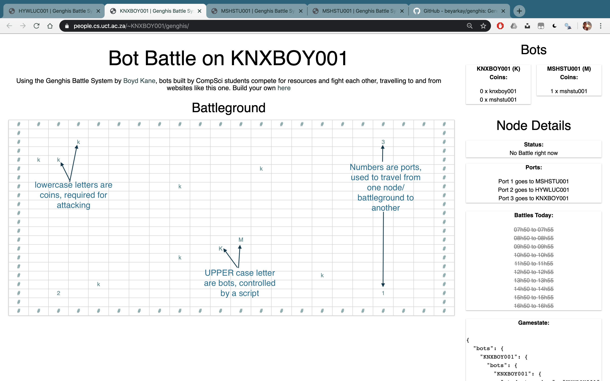

# Genghis Competitive Bot System
[Example of the battle system](https://people.cs.uct.ac.za/~KNXBOY001/genghis/)

Genghis is a collection of scripts that setup, run and coordinate a multi-bot battle system.



To start, a new user clones this repo into their public directory, edits the default bot as 
they like, and then can send that bot out into the network to find other bots to fight against.

## Quick Setup

0. Don't abuse the system, or you'll find your way onto a blacklist.

1. Log into nightmare, and create a `public_html` directory
```
ssh <YOUR STUDENT NUMBER>@nightmare.cs.uct.ac.za
<ENTER YOUR PASSWORD>
mkdir ~/public_html
chmod 755 ~/public_html 
```
2. Copy over some files to get you started:
```
cd ~/public_html
git clone https://github.com/beyarkay/genghis.git
```

3. Now you've got a `bot.py` file which controls your bot. Run the command below to register your bot on the network:
```
cd genghis
python3 connect_to_network.py https://people.cs.uct.ac.za/~KNXBOY001/gm/register.php
```

4. And you're done! Go to [https://people.cs.uct.ac.za/KNXBOY001/gm/](https://people.cs.uct.ac.za/KNXBOY001/gm/) to see bots moving around

